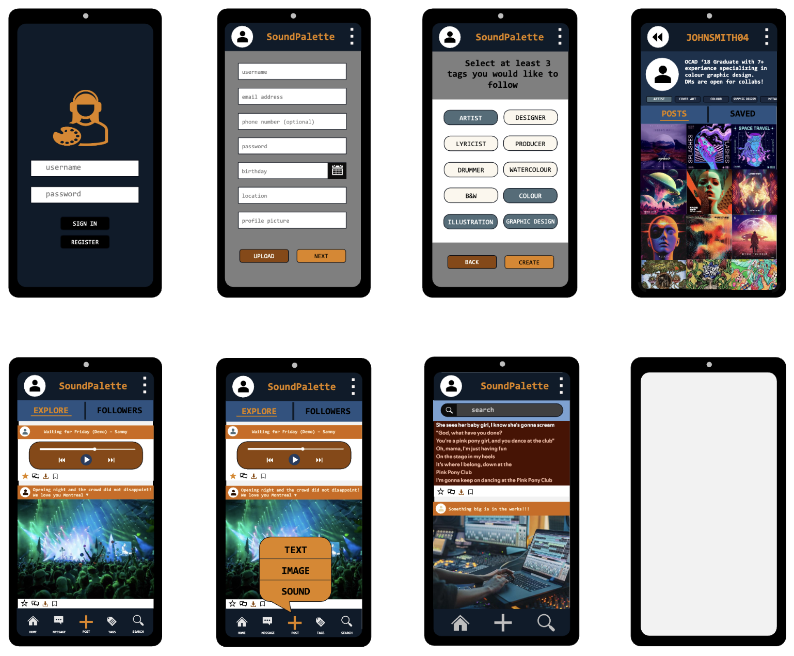

**Date: Monday January 20**

**Time: 4:00pm - 6:00pm**

**Location: ST238 - Library Main Floor**

## Agenda 
- [ ] Technical design
- [x] UI design
- [ ] Database system design

## Attendance
- [x] Parth Chauhan
- [x] Victoria Danh
- [ ] Prab Khokhar - excused
- [ ] Kaija Sproxton - excused
- [x] William White
- [x] James Windjack
      
## Objective 
- To start and (hopefully) complete all design planning for SoundPalette. 
- Ideally will get to a point where we can agree on the foundational design as a group, and assign team members to complete the design.

## UI Design
- Group was able to successfully complete th foundation of our UI design.
- We still need to figure out the colour scheme, logo, icons etc.
- UI Design for Direct Messages, Events and Monetization were not completed and will be revisited in Sprint 4 and 5.

## Next Steps
- Meeting on Wednesday January 22 at 4:00pm- 6:00pm scheduled to go over Technical and Database Designs
