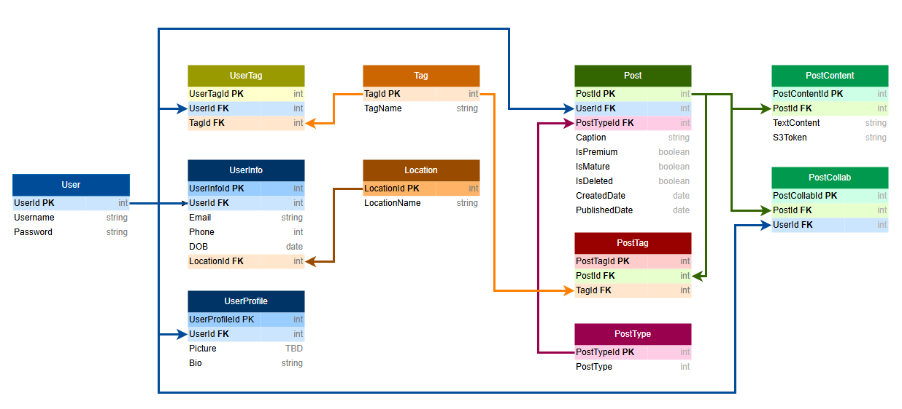

**Date: Wednesday January 22**

**Time: 4:00pm - 6:00pm**

**Location: 235 - Library Main Floor**

## Agenda 
- [x] Database design
- [ ] Set up Macbook users to database

## Objective 
- To start and (hopefully) complete all design planning for SoundPalette. 
- Ideally will get to a point where we can agree on the foundational design as a group, and assign team members to complete the design.

## Attendance
- [x] Parth Chauhan
- [x] Victoria Danh
- [x] Prab Khokhar
- [x] Kaija Sproxton
- [x] William White
- [x] James Windjack

## Macbook Set-up
- Was unable to successfully connect everyone
- Will is going to look into an alternative and will try again at next meeting on Monday January 27

## Database Design
- Completed the foundation of the database design
- Missing:
    - Interactions (likes, comments, saved)
    - Direct Messaging
    - Events
    - Monetization

