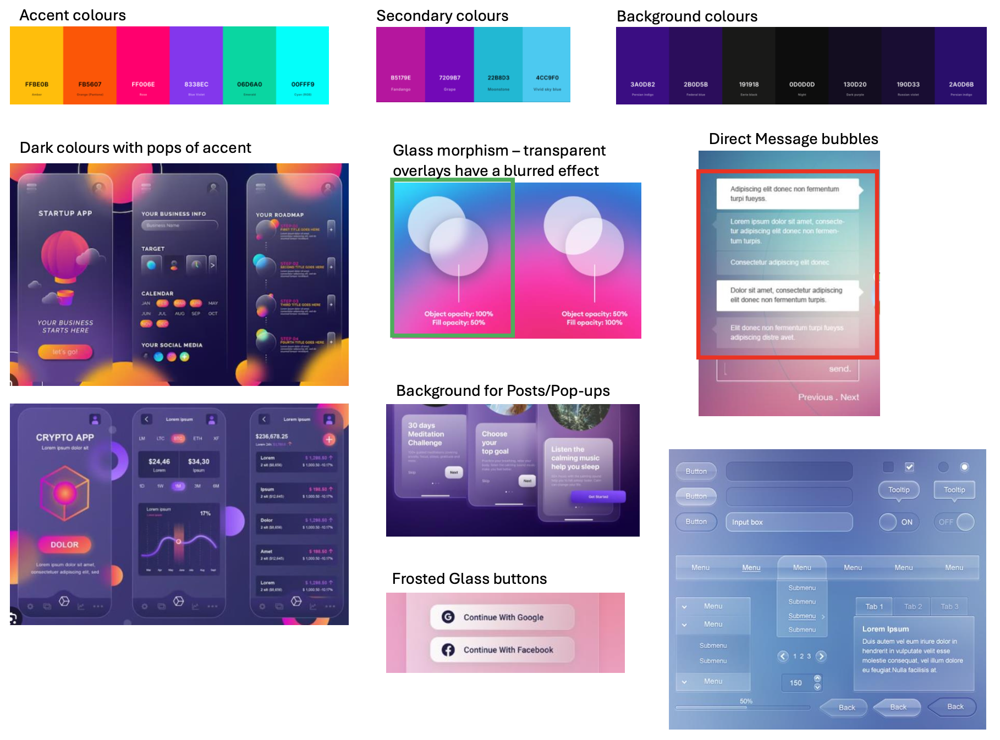

**Date: Tuesday February 25**

**Time: 11:40am - 12:00pm**

**Location: Microsoft Teams**

## Agenda 
- [x] Reflect on Sprint 3
- [x] Revise and Review Sprint 4
- [x] Discuss any questions or concerns

## Attendance
- [x] Parth Chauhan
- [x] Victoria Danh
- [x] Prab Khokhar
- [x] Kaija Sproxton
- [x] William White
- [x] James Windjack
- [x] Brendan Park
- [ ] Naser Ezzati-Jivan

## Sprint 4 Responsbilities
| Sprint # | Name               | Responsbility                      |
|----------| ------------------ | -----------------------------------|
| Sprint 3 | Parth              | Software Testing and Planning      |
| Sprint 3 | Victoria           | Comments, Likes, Saved, Follows    |
| Sprint 3 | Kaija              | Improve overall UI                 |
| Sprint 3 | Prab               | Improve overall UI                 |
| Sprint 3 | Will               | Database, Posts and Model creation |
| Sprint 3 | James              | Tags (User and Posts)              |

## Sprint 4 
- Will is going to implement ability to create a Text Post, as well as displaying posts from API Server, while also creating a script that will generate posts, users etc to the database for everyone to work on the same dataset
- Once Will has completed the Back-End for Posts and generating data, he will begin working on the Algorithm for the Home Page, Trending and Searches
- Prab and Kaija will continue to improve the UI and incorporate glassmorphism designs
- Victoria is going to begin implementing the Comments feature, along with adding a "Follow" button and displaying the # of Follower/Following on profiles
- James is going to begin implementing Tags which includes User's tag selection when registering, displaying the user's tags in bio and Post tags
- Parth will be working with everyone to create test cases and prepare for Software Testing

## UI Discussion
- Prab and Kaija started implementing a glass appearance for the Posts, along with a gradient background
- We will be leaning into this design and incorporating a glassmorphism UI appearance
- Background will contain dark colours to balance the bright accent colours, and enhance the glass appearance

## TA Feedback
- Minimal questions and recognized the need for timeline/feature adjustments
- Recommended changes to UI colour palette due to the blending of pastel and light colours
