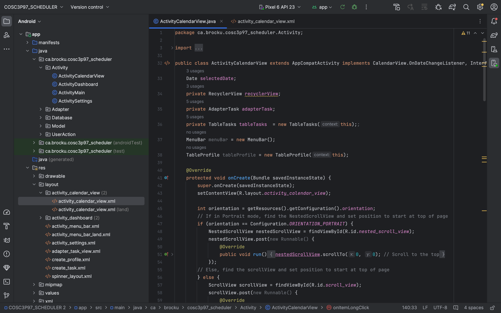
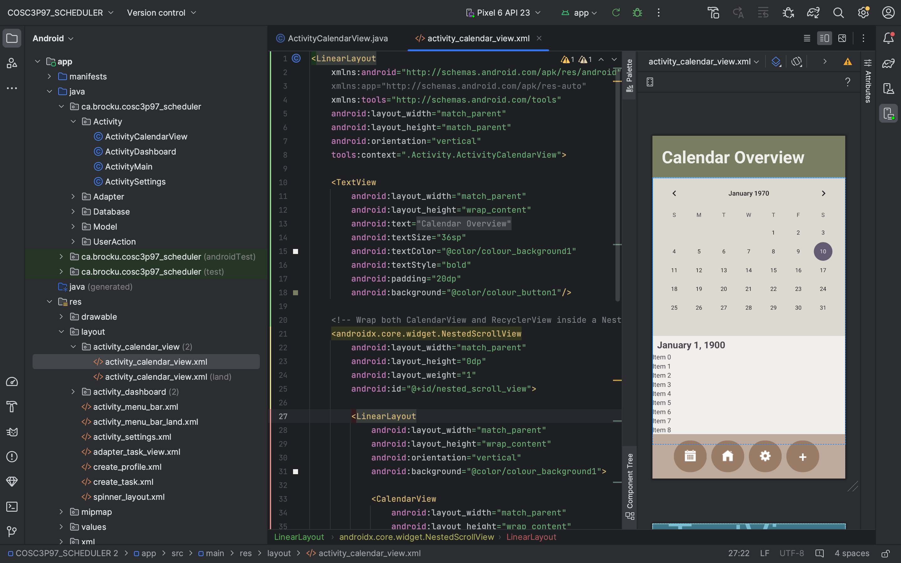

# Android Studio Basics

## Folder Setup
An Android Studio project has a standardized folder structure that is consistent across all applications. Below is a breakdown of the key folders and their purpose:

### 1. **Java Folder**
The `java` folder contains all the code that defines the app's functionality. This code is responsible for how the user interface (UI) interacts with the user and the device.
- **Purpose**: Handles the logic and behavior of the app.
- **Structure**: There is typically at least one `.java` file associated with each `.xml` layout file.
- **Example**: A `MainActivity.java` file might handle button clicks or user inputs.

### 2. **Res (Resources) Folder**
The `res` folder contains all the UI-related files and resources that your app needs to display content to users.

#### Subfolders in the `res` Directory:
1. **drawable**
   - Contains images and graphic assets used in the app.
   - Supports different image resolutions for various screen sizes and densities.
   - Example: Logos, icons, and background images.

2. **layout**
   - Contains the XML files that define the app's user interface.
   - Each XML file represents a screen or part of a screen.
   - Example: `activity_main.xml` defines the layout for the main screen of the app.

3. **values**
   - Stores reusable resources such as colors, strings, and dimensions.
   - Helps to keep your code clean and maintainable by defining these values in one place.
   - Example:
     ```xml
     <resources>
         <color name="colorPrimary">#6200EE</color>
         <string name="app_name">MyApp</string>
     </resources>
     ```
   - You can reference these values in your layout files or Java code.

## .java vs .xml Files
In Android development, `.java` and `.xml` files work together to create a fully functional app. The `.xml` files define the user interface (UI), while the `.java` files control the logic and behavior of the app.

### .java
- `.java` files contain the code that controls how the app responds to user interactions and events.
- These files reference the objects and UI components defined in the corresponding `.xml` layout files.
- Function methods in `.java` handle actions such as button clicks, text input, and navigation.



**Example:** In the screenshot above, you can see the `.java` file for the `CalendarView` of a scheduling app. The script references the UI components from the `.xml` file and defines what happens when users interact with the calendar.

### .xml
- `.xml` files define the layout and appearance of the app’s UI.
- Each UI component (such as buttons, text views, and images) is defined in the `.xml` file and assigned a unique id.
- The `id` allows the corresponding `.java` file to reference these components and control their behavior.



**Example:** In the screenshot above, you can see the `.xml` file for the `CalendarView` of a scheduling app. The screen is split into two parts. The first part is the code editor on the left and a visual preview of the app on the right. This split view helps developers see how changes in the `.xml` file affect the app’s appearance in real time.


### How .java and .xml Work Together
**1. Layout Definition:** The UI is defined in an `.xml` file.
**2. Component Reference:** Each UI component is given a unique id in the `.xml` file.
**3. Behavior Implementation:** The `.java` file references the id and defines actions for user interactions.

### Example Workflow:
- In `activity_main.xml`, a button is defined with the `id="btnSubmit"`.
- In `MainActivity.java`, the button is referenced using `findViewById(R.id.btnSubmit)`.
- The `.java` file then defines what happens when the button is clicked, such as showing a message or navigating to another screen.
