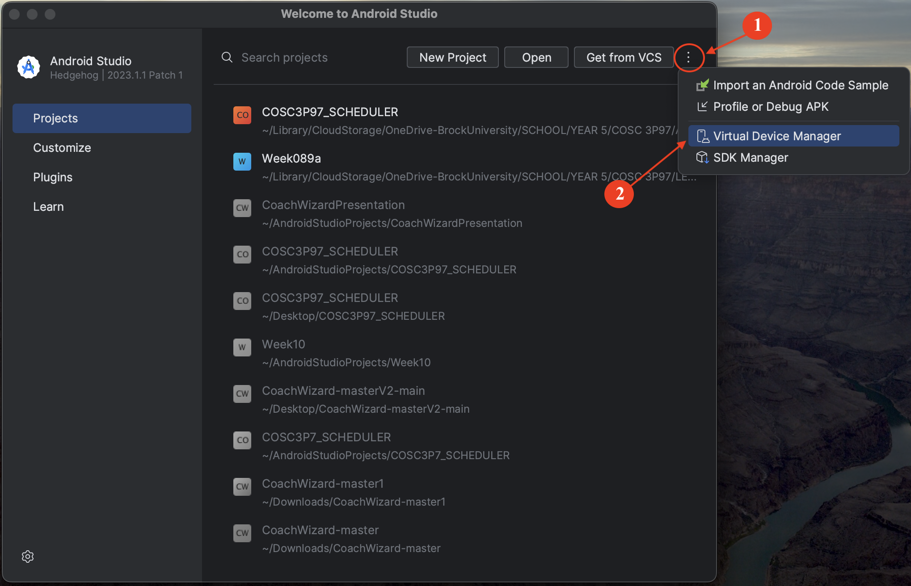
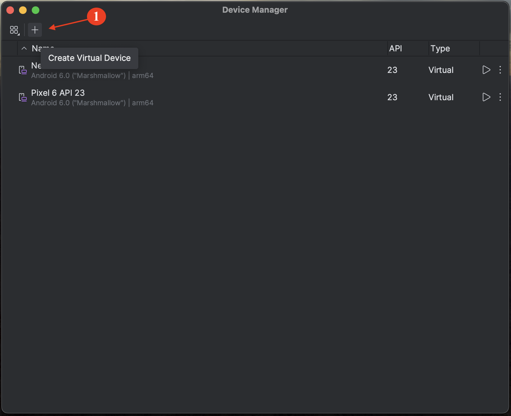
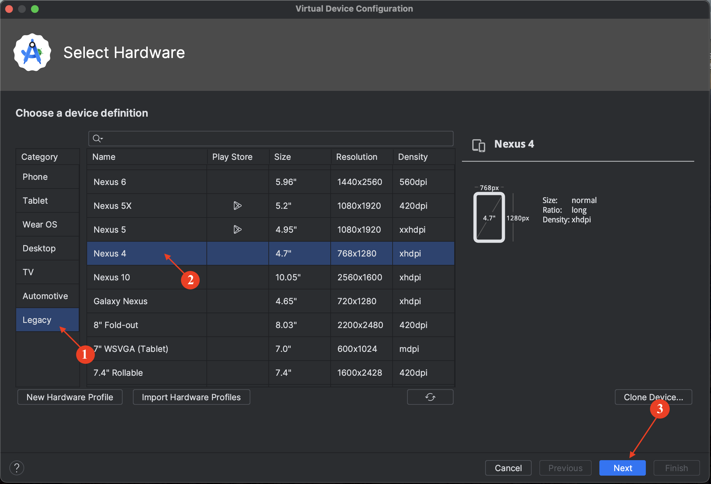
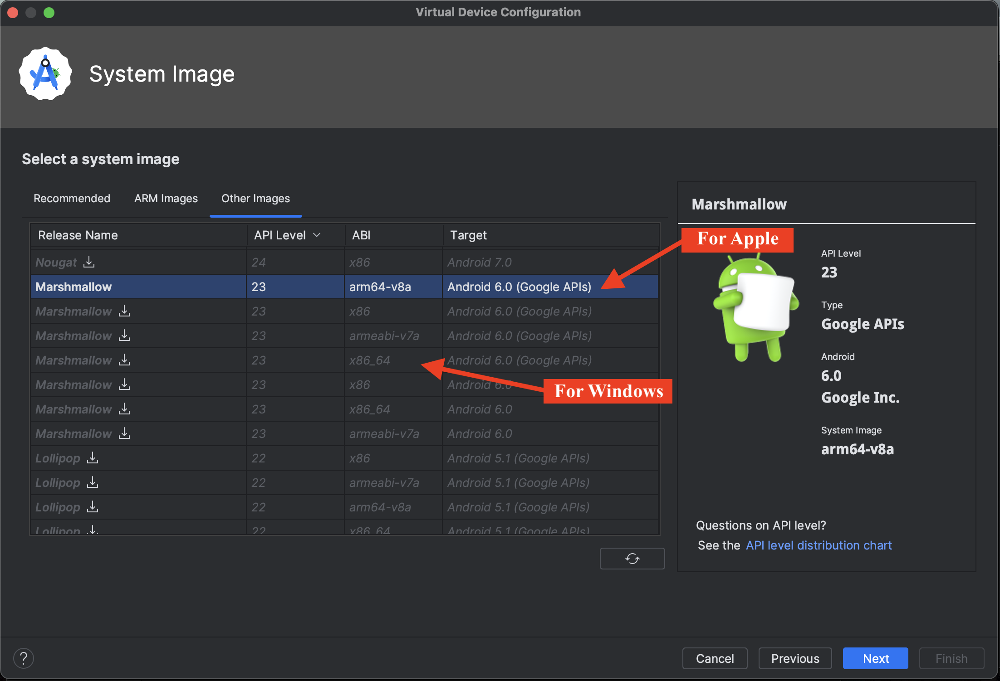
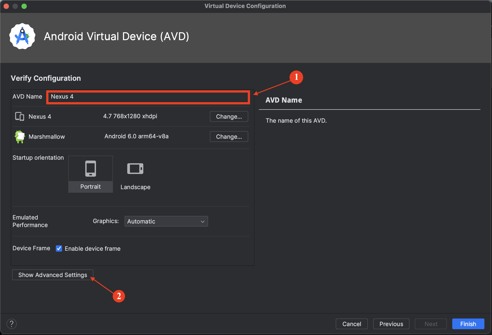
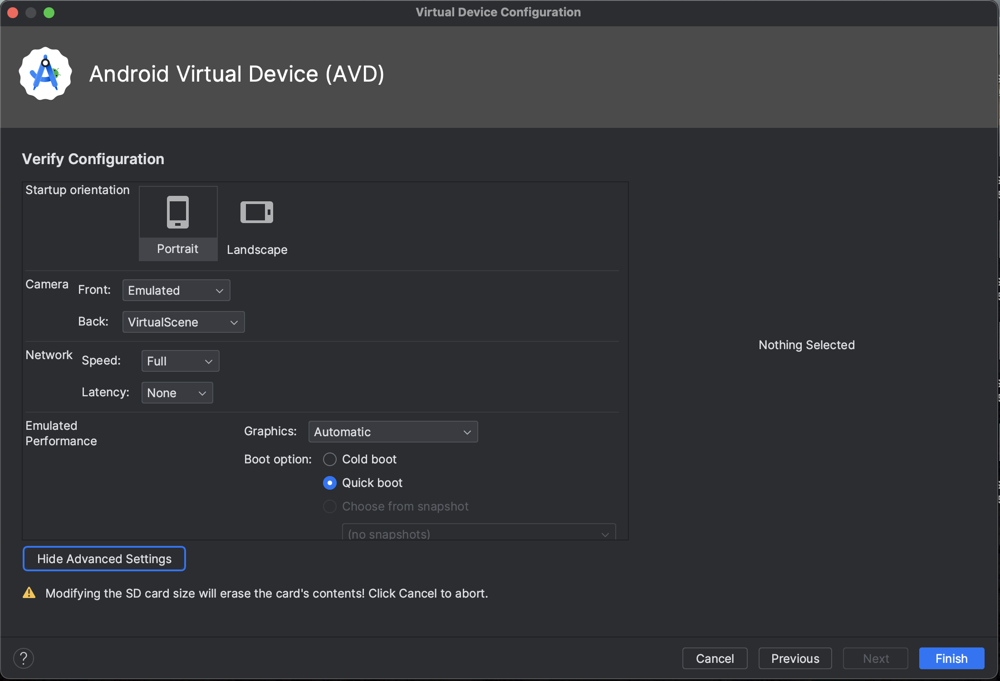
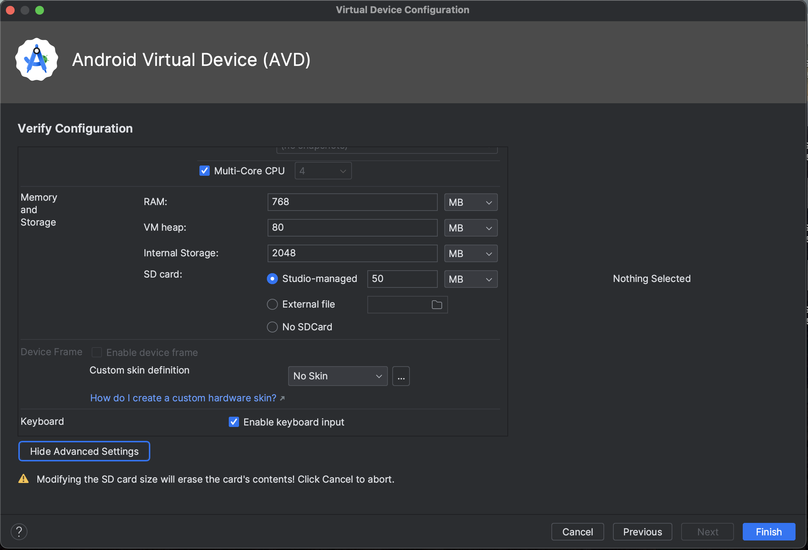

## Setting up the Android Emulator
- The Android Emulator is a virtual device that allows you to test your app without needing a physical device.
- It simulates various Android devices with different screen sizes, resolutions, and Android versions.

1. Click the three dots for more options > Virtual Device Manager

2. Click the "+" button to Create a Virtual Device

3. Select "Legacy" > Nexus 4 > Next
    - Note: You can choose another Android device to set as your virtual device

4. Select "Other Images" > Scroll until you see Marshmellow > Download > Next
    - Note: Selection will depend on your device, see screenshot

5. Name your device > Click on "Show Advanced Setting"
    - Boot option: Quickboot
    - Internal Storage: 2048
    - SD Card: Studio Managed (at least 100 MB)
    - Remaining settings based on the device you selected

6. Finish
